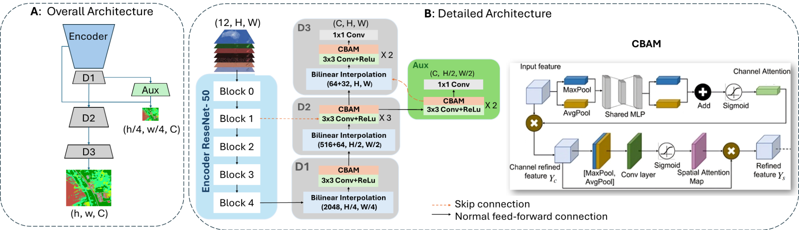

# MUSCLE-Net-Enhancing-Land-Cover-Semantic-Segmentation-with-CBAM-and-Deep-Supervision
Official implementation of MUSCLE-Net, a land-cover semantic segmentation model with CBAM and deep supervision for DFC2020 and DynamicEarthNet
## MUSCLE-Net architecture

The figure below illustrates the overall architecture of MUSCLE-Net, including the encoder, CBAM-enhanced decoder, and deep supervision branches.

