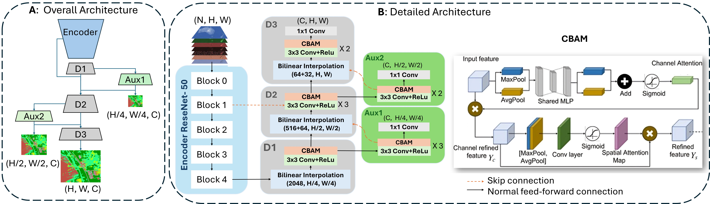

# MUSCLE-Net-Enhancing-Land-Cover-Semantic-Segmentation-with-CBAM-and-Deep-Supervision
Official implementation of MUSCLE-Net, a land-cover semantic segmentation model with CBAM and deep supervision for DFC2020 and DynamicEarthNet
## MUSCLE-Net architecture

The figure below illustrates the overall architecture of MUSCLE-Net, including the encoder, CBAM-enhanced decoder, and deep supervision branches.



## Model Details

The proposed MUSCLE-Net uses a CBAM-enhanced decoder and **one auxiliary deep-supervision branch generated at resolution H/4 × W/4**.

During training, the auxiliary branch is combined with the main segmentation output using:

- **Main loss weight:** 0.90  
- **Auxiliary branch weight:** 0.10  

The auxiliary weight of **0.10** was selected because it produced the best performance in our experiments.


### Encoder Backbone

We initialize the encoder using a pretrained ResNet-50 model from **BigEarthNet v2.0**, a large-scale remote sensing dataset.

🔗 https://bigearth.net/

The implementation relies on:

```python
from reben_publication.BigEarthNetv2_0_ImageClassifier import BigEarthNetv2_0_ImageClassifier 

```
## Repository Structure

- `models/attention.py`: CBAM, channel attention, and spatial attention
- `models/muscle_net.py`: MUSCLE-Net architecture
- `data/dataset.py`: DFC2020 data loading and preprocessing
- `utils/losses.py`: deep-supervision loss with auxiliary branch weight 0.10
- `utils/metrics.py`: IoU computation
- `utils/seed.py`: reproducibility utilities
- `train.py`: training script for repeated runs
- `config.py`: experiment settings
### Efficiency and Environmental Impact

| Model | Time / Epoch (s) | Avg. Epochs (5 runs) | Emissions (kg CO₂eq / epoch) |
|-------|-------------------|----------------------|-------------------------------|
| **MUSCLE-Net** | 296.57 | 86.8 ± 30.15 | 0.000072 |
| UNet | 64.38 | 107.8 ± 53.80 | 0.000017 |
| DeepLabV3 | 217.69 | 73.4 ± 30.07 | 0.000053 |
| PSPNet | 45.00 | 75.6 ± 25.77 | 0.000012 |

## Paper

S. Mobsite et al., *Enhancing Land Cover Semantic Segmentation with Convolutional Block Attention Modules and Deep Supervision*, submitted to **Artificial Intelligence in Geosciences**.
